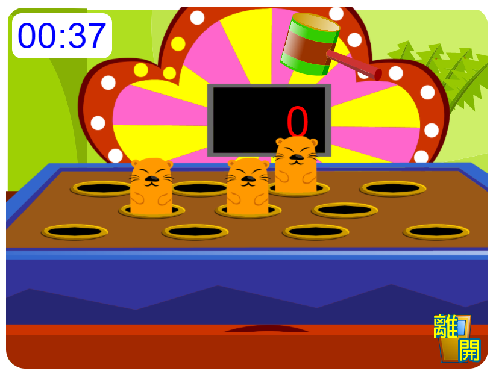

# Flash game convert to HTML

Rendering: **DOM rendering with CSS sprite** 
 - cost-efficient, faster than ordinary DOM rendering
 - intuitive, more readable than canvas 

Use of javascript closure and IIFE can also provide immutability and readability to the program.